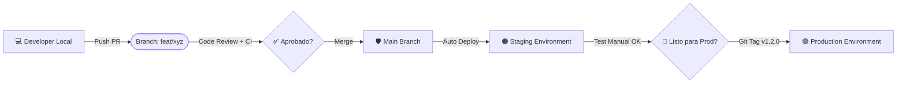

#  Trunk-Based Development (TBD) en Lead UPN Trujillo

**Autor:** [Axel Castro A.] 

**Fecha:** [08/03/2026] 

**Versión:** 1.2.1

---

## 1. ¿Por qué TBD en Lead UPN?
En Lead UPN Trujillo, no queremos perder tiempo resolviendo conflictos de código de hace dos semanas. Queremos entregar valor continuo. Trunk-Based Development (TBD) significa que todos trabajamos sobre una única rama principal (main) haciendo integraciones pequeñas y frecuentes.

### El Estándar:
* Ramas efímeras: Viven máximo 1 a 3 días.
* Commits Atómicos: Pequeños cambios con un propósito único.
* Main siempre verde: main siempre debe ser desplegable.
* Feature Flags: El código se sube oculto hasta que esté listo.

---

## 2. Flujo de Trabajo (Workflow)

### Arquitectura de Ramas y Entornos

1. **Local**: Tu entorno de desarrollo.
2. **Pull Request (PR)**: Validación de código obligatoria.
3. **Main**: La verdad absoluta del código.
4. **Staging**: Copia fiel de producción para pruebas finales (se actualiza con cada merge a main).
5. **Production**: Donde viven los usuarios (se actualiza solo al crear un Tag).

---

## 3. Tipos de Ramas y Ciclo de Vida
En Lead UPN, las ramas son efímeras.

### Feature Branch (`feat/`)
* **Origen**: main
* **Destino**: main
* **Vida**: 1-2 días.
* **Naming**: `feat/nombre-descriptivo` o `feat/ticket-id-descripcion`
* **Uso**: Nuevas funcionalidades.

### Bugfix Branch (`fix/`)
* **Origen**: main
* **Destino**: main
* **Vida**: Horas.
* **Naming**: `fix/que-estas-arreglando`
* **Uso**: Bugs encontrados durante el desarrollo o en Staging.

### Chore Branch (`chore/`)
* **Origen**: main
* **Destino**: main
* **Vida**: < 1 día.
* **Naming**: `chore/descripcion`
* **Uso**: Actualizar librerías, config de webpack, limpiar logs.

### Hotfix Branch (`hotfix/`)
* **Origen**: tag actual de producción (ej. v1.2.0).
* **Destino**: main Y nuevo tag.
* **Uso**: EMERGENCIAS EN PRODUCCIÓN.
* **Proceso**:
    1.  Rama desde el tag: `git checkout -b hotfix/critical-bug v1.2.0`
    2.  Arreglar y commitear.
    3.  Push y PR urgente a main.
    4.  Crear Tag inmediato v1.2.1 para deployar.

--- 

##  **Para profundizar:**  
Si tienes alguna duda particular o quieres ver el detalle completo, revisa la sección correspondiente en la guía original: [Guía: Trunk-Based Development][URL].

[URL]: https://Rellenar-en-un-momento.com

